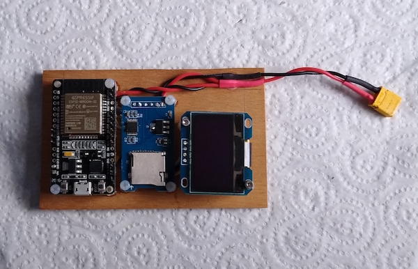

# uav_electronic_ids
A collection of programmes and libraries for Arduinos that implement various electronic IDs and ATM/UTM interfaces.

Developed using a basic ESP32 dev module (https://www.banggood.com/Geekcreit-ESP32-WiFi+bluetooth-Development-Board-Ultra-Low-Power-Consumption-Dual-Cores-Pins-Unsoldered-p-1214159.html).

